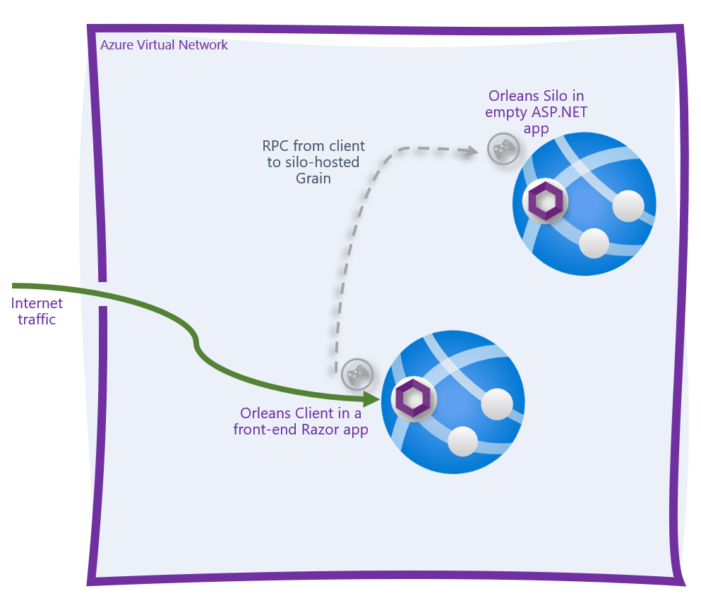

# Orleans Silo + Client on Azure App Service

This repository contains a simple solution with an Orleans Silo and an Orleans Client project. Both are deployed to Azure App Services running in a regional virtual network, using Azure Storage clustering. The folders off of the root are described below:

* Orleans.Azure.Infrastructure - an experimental project designed to support hosting Orleans Silos in Azure App Service or Container Apps with little wire-up.
* OrleansOnAppService.Abstractions - project containing the Grain interfaces.
* OrleansOnAppService.Grains - project containing the Grain implementations.
* OrleansOnAppService.Silo - a simple ASP.NET Core project that hosts the Orleans silo.
* OrleansOnAppService.Client - a simple ASP.NET Core Razor project that serves as a client to the silo and provides a simple user interface.
* ```deploy``` folder - this folder contains a series of [Azure Bicep](http://aka.ms/bicep) templates that can be used to create the application and deploy it.
* ```setup.ps1``` - this file is a one-stop way for you to deploy the app to your own Azure subscription so you can try the scenario. 

## Prerequisites

* .NET 6.0
* The Azure CLI
* An Azure subscription
* PowerShell *(GitHub Actions will replace this prerequisite soon)*

## Setup

1. Clone this repository.
2. Sign in to your Azure subscription using the `az login` command.
3. If you have more than 1 Azure subscription, make sure you're targeting the *right* Azure subscription by using the `az account show` and `az account set -s <subscription-id>` commands.
4. From the root of this repository, run `./setup.ps1`. 

## Topology diagram

The resultant application is an Orleans clusted comprised of a trio of App Services - the `silo`, and the `client` Razor Pages front-end, and the community-contributed Orleans Dashboard, so you can see a snapshot of all the grains, silos, and messages in the cluster.



> Note: the dashboard was omitted from the diagram to show the most basic silo/client topology possible. 
> 